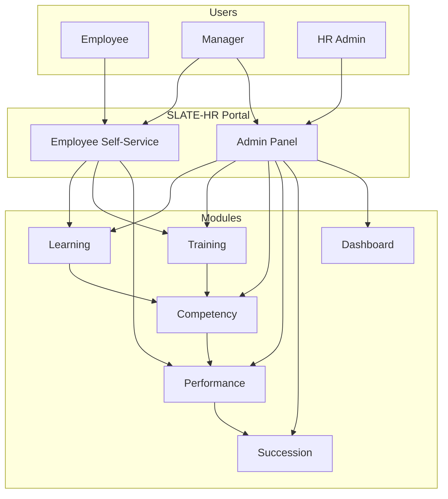
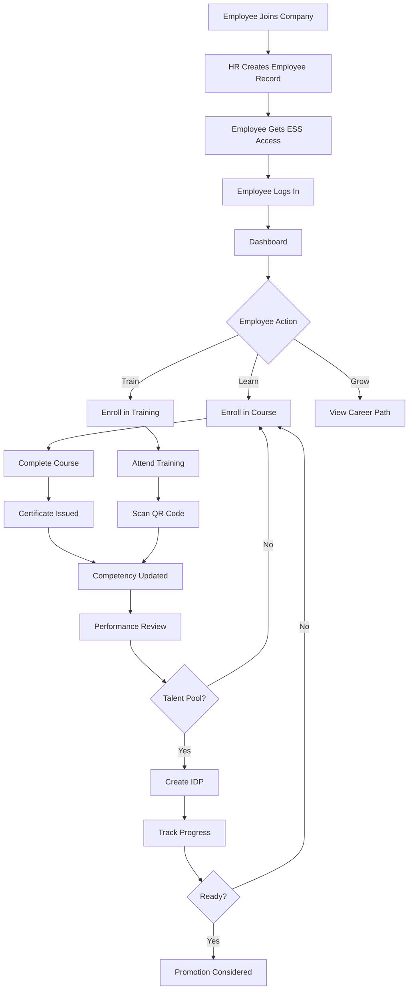
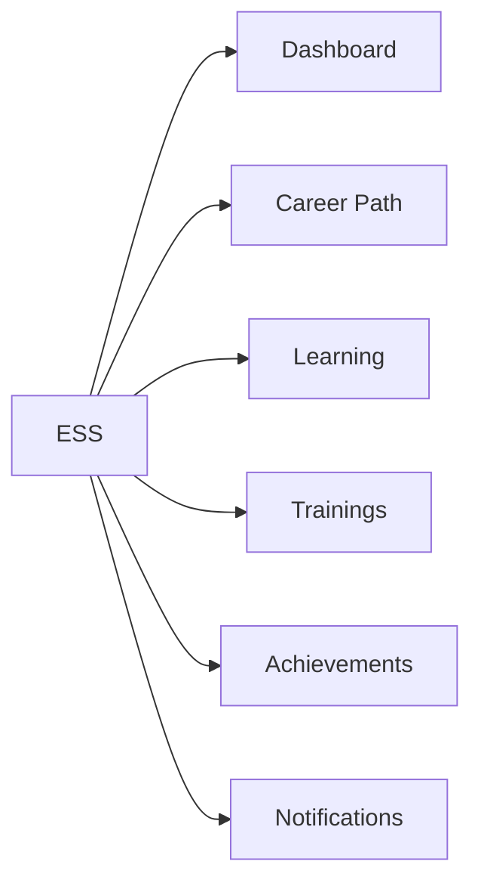
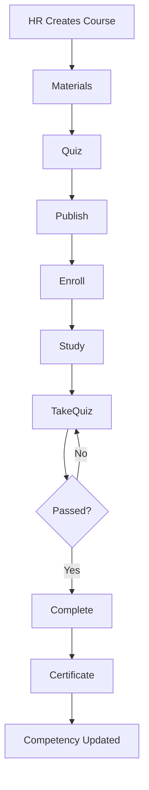
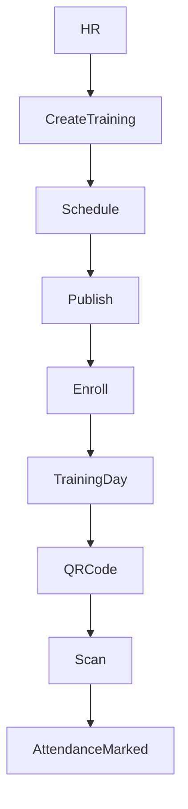
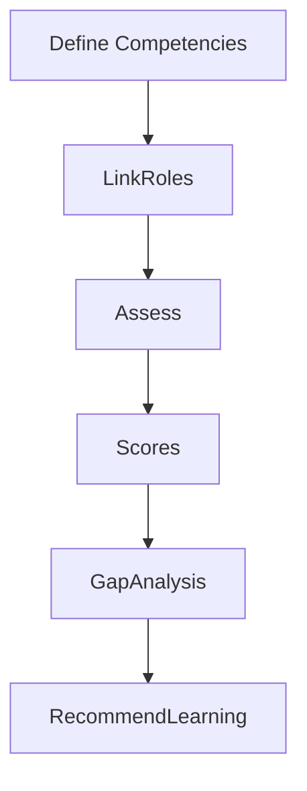
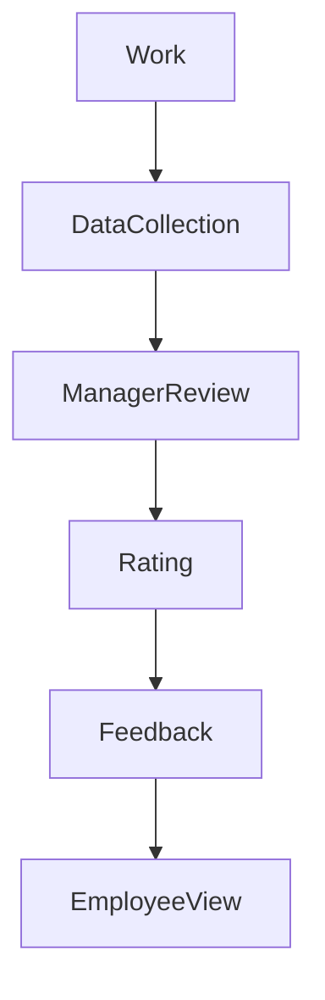
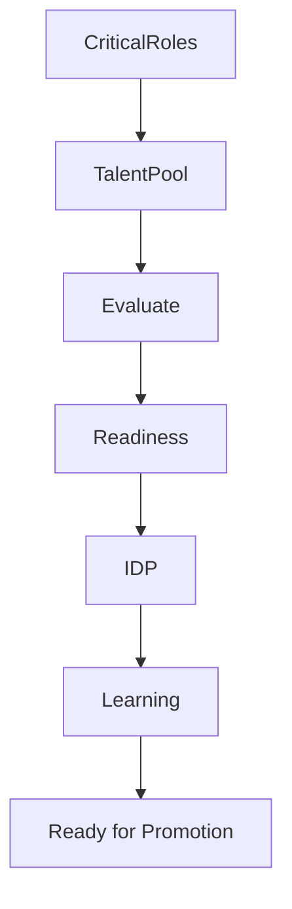
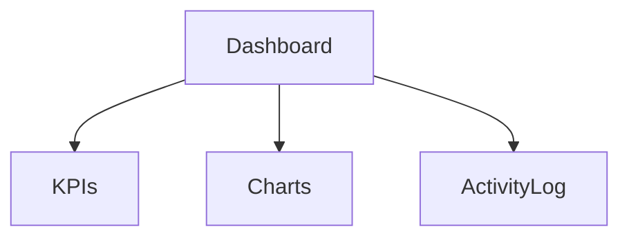
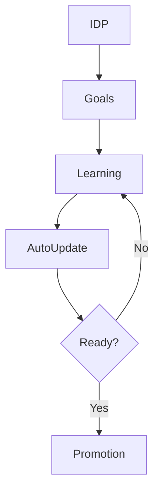

# SLATE-HR System User Guide

## Complete Documentation for Students and End Users

---

## Table of Contents

1. [Introduction](#1-introduction)
2. [System Overview](#2-system-overview)
3. [End-to-End Process](#3-end-to-end-process)
4. [Module 1: Employee Self-Service (ESS)](#4-module-1-employee-self-service-ess)
5. [Module 2: Learning Management](#5-module-2-learning-management)
6. [Module 3: Training Management](#6-module-3-training-management)
7. [Module 4: Competency Management](#7-module-4-competency-management)
8. [Module 5: Performance Management](#8-module-5-performance-management)
9. [Module 6: Succession Planning](#9-module-6-succession-planning)
10. [Module 7: Admin Dashboard](#10-module-7-admin-dashboard)
11. [Quick Reference Guide](#11-quick-reference-guide)
12. [Appendix: System Flow Diagrams](#12-appendix-system-flow-diagrams)

---

## 1. Introduction

### What is SLATE-HR?

SLATE-HR is an integrated Human Resources system designed to manage employees, learning, training, competencies, performance, and succession planning in one unified platform.

### Who Uses This System?

* **Employees** – Learn, attend trainings, upload achievements, and track career growth.
* **Managers** – Review performance, give feedback, and develop team members.
* **HR Administrators** – Configure the system, manage learning, competencies, and plan future leadership.

### Why This System Exists

* Reduce paperwork and manual HR processes
* Connect learning, training, and performance data
* Identify and develop future leaders
* Support data-driven HR decisions

---

## 2. System Overview

### System Architecture Diagram

### Key Features at a Glance

| Feature                | Description                       | Users               |
| ---------------------- | --------------------------------- | ------------------- |
| Employee Self-Service  | Personal employee portal          | Employees           |
| Learning Management    | Online courses & e-learning       | Employees, HR       |
| Training Management    | Live trainings with QR attendance | Employees, HR       |
| Competency Management  | Skill and capability tracking     | HR, Managers        |
| Performance Management | Reviews and feedback              | Managers, Employees |
| Succession Planning    | Leadership pipeline planning      | HR, Leadership      |
| Admin Dashboard        | Analytics & system overview       | HR, Management      |

---

## 3. End-to-End Process

### Complete Employee Journey

---

## 4. Module 1: Employee Self-Service (ESS)

### ESS Structure

### Key Capabilities

* View dashboard summary and calendar
* Enroll in courses and trainings
* Scan QR codes for attendance
* Upload achievements
* Track career growth and performance

---

## 5. Module 2: Learning Management

### Learning Flow

---

## 6. Module 3: Training Management

### Training Flow

---

## 7. Module 4: Competency Management

### Competency Lifecycle

---

## 8. Module 5: Performance Management

### Performance Review Flow

---

## 9. Module 6: Succession Planning

### Succession Planning Flow

---

## 10. Module 7: Admin Dashboard

### Dashboard Overview

---

## 11. Quick Reference Guide

### Employees

| Task               | Location           |
| ------------------ | ------------------ |
| Enroll in course   | ESS → Learning     |
| Attend training    | ESS → Trainings    |
| Upload achievement | ESS → Achievements |
| View career path   | ESS → Career Path  |

### HR / Admin

| Task                | Location           |
| ------------------- | ------------------ |
| Create course       | Admin → Learning   |
| Create training     | Admin → Training   |
| Define competencies | Admin → Competency |
| Manage succession   | Admin → Succession |

---

## 12. Appendix: Automation Flow

### IDP Progress Automation

---

**Document Version:** 1.0
**Audience:** Students and End Users
**Format:** Markdown (.md)
