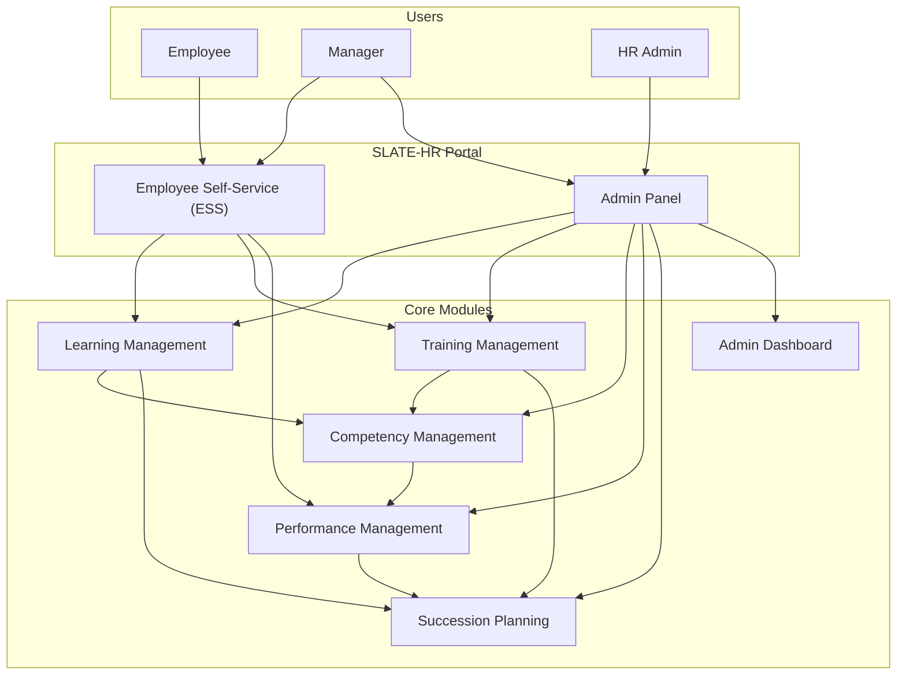
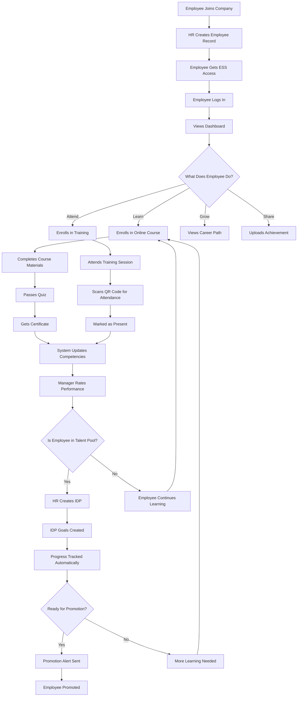
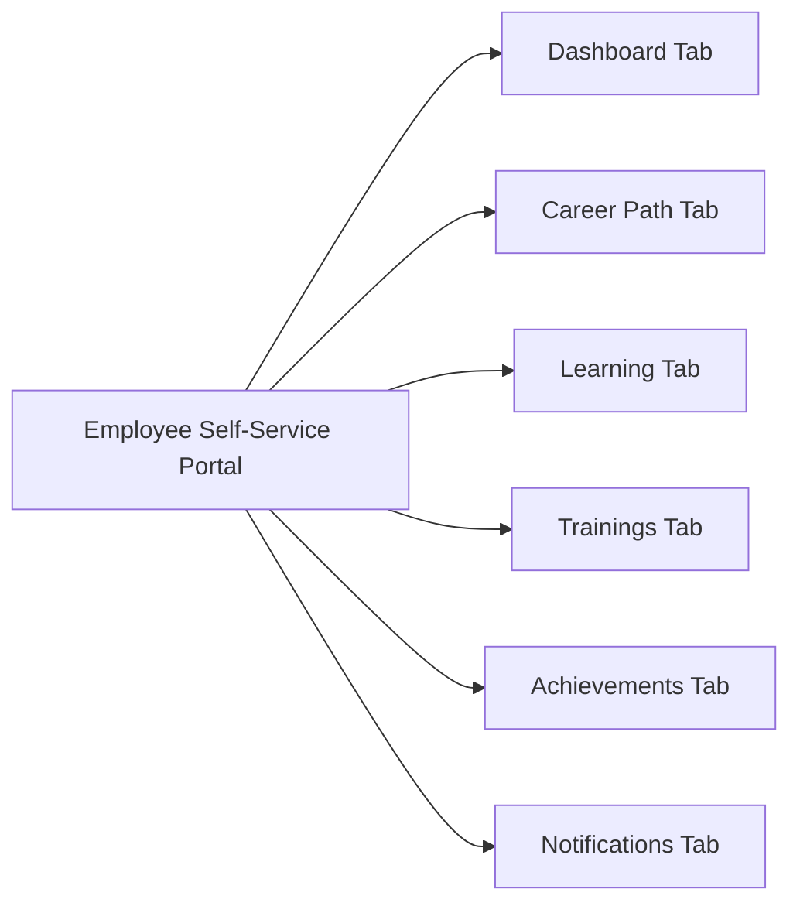

# SLATE-HR System User Guide

## Complete Documentation for Students and End Users

---

## Table of Contents

1. [Introduction](#1-introduction)
2. [System Overview](#2-system-overview)
3. [End-to-End Process](#3-end-to-end-process)
4. [Module 1: Employee Self-Service (ESS)](#4-module-1-employee-self-service-ess)
5. [Module 2: Learning Management](#5-module-2-learning-management)
6. [Module 3: Training Management](#6-module-3-training-management)
7. [Module 4: Competency Management](#7-module-4-competency-management)
8. [Module 5: Performance Management](#8-module-5-performance-management)
9. [Module 6: Succession Planning](#9-module-6-succession-planning)
10. [Module 7: Admin Dashboard](#10-module-7-admin-dashboard)
11. [Quick Reference Guide](#11-quick-reference-guide)
12. [Appendix: System Flow Diagrams](#12-appendix-system-flow-diagrams)

---

## 1. Introduction

### What is SLATE-HR?

SLATE-HR is an integrated Human Resources system that helps organizations manage employees, learning, training, skills, performance, and future leadership planning in one place.

### Who Uses This System?

* **Employees**: Access their personal portal to enroll in courses, attend trainings, view achievements, and track their career growth.
* **Managers**: Review employee performance, approve requests, and help develop their team members.
* **HR Administrators**: Manage the entire system, create courses/trainings, set up competencies, and plan for future leadership needs.

### Why This System Exists

* Reduces paperwork and manual tracking.
* Connects learning, training, and performance data.
* Helps identify and develop future leaders.
* Provides clear insights for better decision-making.

---

## 2. System Overview

### System Architecture Diagram

### Key Features at a Glance

| Feature                    | What It Does                              | Who Uses It             |
| -------------------------- | ----------------------------------------- | ----------------------- |
| **Employee Self-Service**  | Personal portal for employees             | All Employees           |
| **Learning Management**    | Online courses and e-learning             | Employees, HR           |
| **Training Management**    | Live training sessions with QR attendance | Employees, HR, Trainers |
| **Competency Management**  | Track skills and abilities                | HR, Managers            |
| **Performance Management** | Performance reviews and feedback          | Employees, Managers     |
| **Succession Planning**    | Plan for future leaders                   | HR, Leadership          |
| **Admin Dashboard**        | System overview and analytics             | HR, Management          |

---

## 3. End-to-End Process

### Complete Employee Journey

### Process Steps Explained

1. **Employee Onboarding**

   * HR creates the employee profile.
   * Employee receives login credentials and accesses ESS.

2. **Employee Self-Service Activities**

   * Employee explores available courses and trainings.
   * Employee enrolls in learning opportunities.
   * Employee views career path and development options.

3. **Learning & Development**

   * Employee completes online courses and live trainings.
   * System tracks completion and attendance automatically.

4. **Skills & Performance Tracking**

   * System updates competency scores based on learning.
   * Manager rates employee performance.
   * Employee sees their progress and feedback.

5. **Succession Planning**

   * Employee is added to talent pool for critical roles if suitable.
   * IDP is created with goals linked to learning and trainings.
   * Progress is tracked automatically.
   * When ready, employee is considered for promotion.

---

## 4. Module 1: Employee Self-Service (ESS)

### What is ESS?

The Employee Self-Service portal is the employee’s personal dashboard where they can manage their learning, view trainings, track achievements, and see their career development.

### ESS Structure

*(All succeeding sections retain their original explanations; only diagram syntax was corrected.)*

---

**Document Version:** 1.0
**Audience:** End Users of SLATE-HR
**Format:** Markdown (`.md`)
