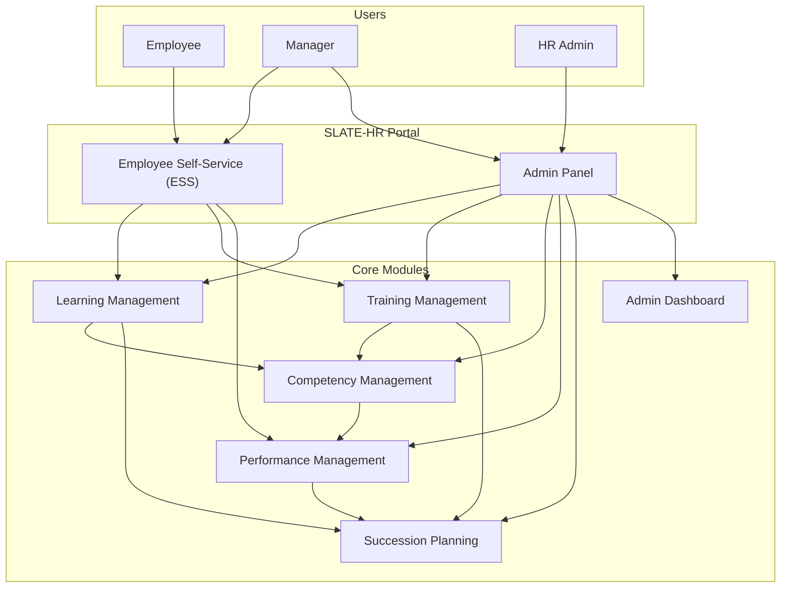
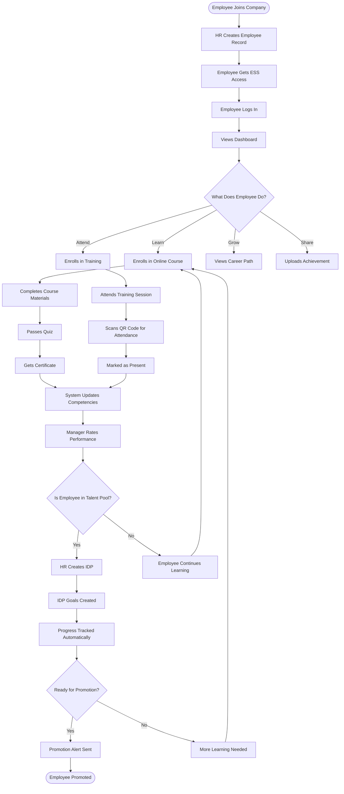
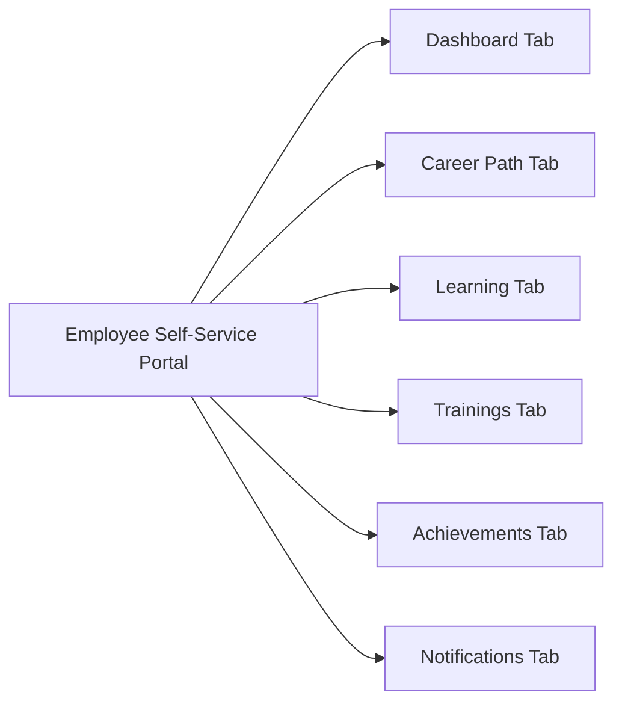
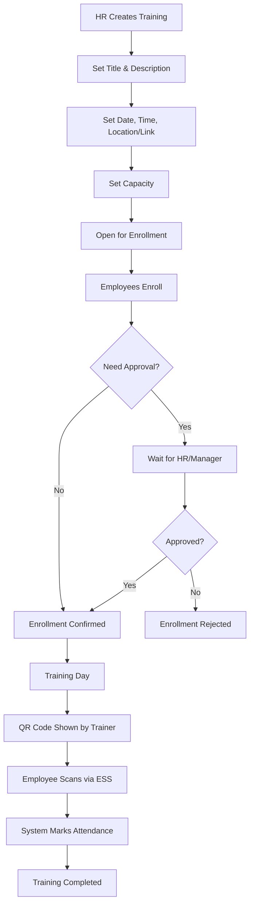
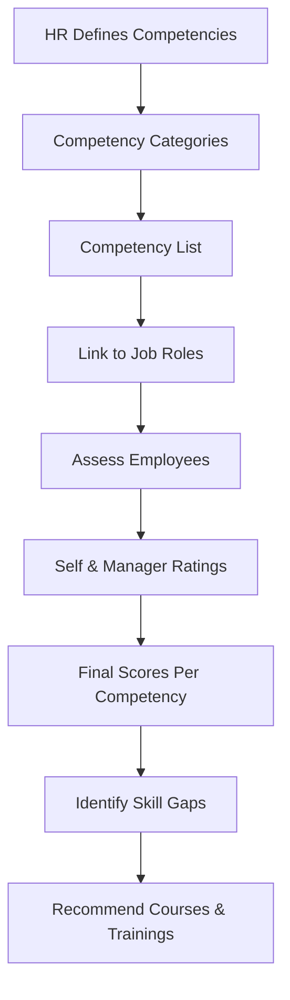
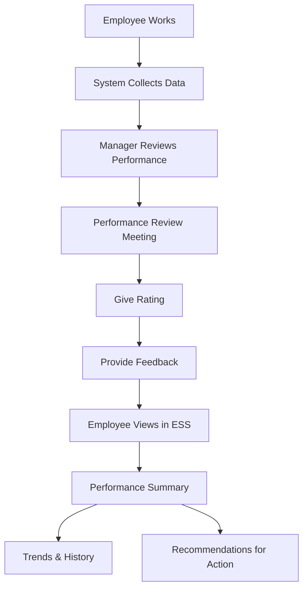
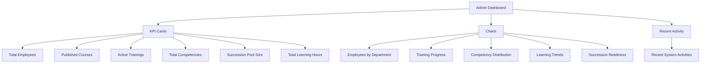
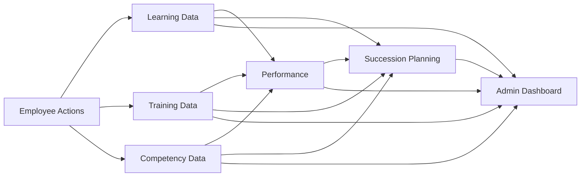
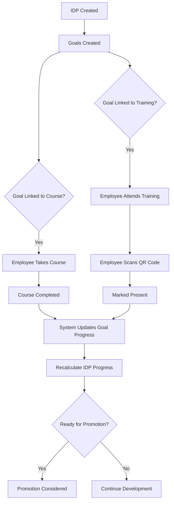

# SLATE-HR System User Guide

## Complete Documentation for Students and End Users

---

## Table of Contents

1. [Introduction](#1-introduction)  
2. [System Overview](#2-system-overview)  
3. [End-to-End Process](#3-end-to-end-process)  
4. [Module 1: Employee Self-Service (ESS)](#4-module-1-employee-self-service-ess)  
5. [Module 2: Learning Management](#5-module-2-learning-management)  
6. [Module 3: Training Management](#6-module-3-training-management)  
7. [Module 4: Competency Management](#7-module-4-competency-management)  
8. [Module 5: Performance Management](#8-module-5-performance-management)  
9. [Module 6: Succession Planning](#9-module-6-succession-planning)  
10. [Module 7: Admin Dashboard](#10-module-7-admin-dashboard)  
11. [Quick Reference Guide](#11-quick-reference-guide)  
12. [Appendix: System Flow Diagrams](#12-appendix-system-flow-diagrams)  

---

## 1. Introduction

### What is SLATE-HR?

SLATE-HR is an integrated Human Resources system that helps organizations manage employees, learning, training, skills, performance, and future leadership planning in one place.

### Who Uses This System?

- **Employees**: Access their personal portal to enroll in courses, attend trainings, view achievements, and track their career growth.  
- **Managers**: Review employee performance, approve requests, and help develop their team members.  
- **HR Administrators**: Manage the entire system, create courses/trainings, set up competencies, and plan for future leadership needs.

### Why This System Exists

- Reduces paperwork and manual tracking.  
- Connects learning, training, and performance data.  
- Helps identify and develop future leaders.  
- Provides clear insights for better decision-making.

---

## 2. System Overview

### System Architecture Diagram



### Key Features at a Glance

| Feature | What It Does | Who Uses It |
|--------|--------------|-------------|
| **Employee Self-Service** | Personal portal for employees | All Employees |
| **Learning Management** | Online courses and e-learning | Employees, HR |
| **Training Management** | Live training sessions with QR attendance | Employees, HR, Trainers |
| **Competency Management** | Track skills and abilities | HR, Managers |
| **Performance Management** | Performance reviews and feedback | Employees, Managers |
| **Succession Planning** | Plan for future leaders | HR, Leadership |
| **Admin Dashboard** | System overview and analytics | HR, Management |

---

## 3. End-to-End Process

### Complete Employee Journey



### Process Steps Explained

1. **Employee Onboarding**  
   - HR creates the employee profile.  
   - Employee receives login credentials and accesses ESS.

2. **Employee Self-Service Activities**  
   - Employee explores available courses and trainings.  
   - Employee enrolls in learning opportunities.  
   - Employee views career path and development options.

3. **Learning & Development**  
   - Employee completes online courses and live trainings.  
   - System tracks completion and attendance automatically.

4. **Skills & Performance Tracking**  
   - System updates competency scores based on learning.  
   - Manager rates employee performance.  
   - Employee sees their progress and feedback.

5. **Succession Planning**  
   - Employee is added to talent pool for critical roles if suitable.  
   - IDP is created with goals linked to learning and trainings.  
   - Progress is tracked automatically.  
   - When ready, employee is considered for promotion.

---

## 4. Module 1: Employee Self-Service (ESS)

### What is ESS?

The Employee Self-Service portal is the employee's personal dashboard where they can manage their learning, view trainings, track achievements, and see their career development.

### ESS Structure



### 4.1 Dashboard Tab

**What You See:**

- Summary cards showing learning progress, upcoming trainings, notifications.  
- Calendar with scheduled trainings.  
- Quick links to main actions.

**What You Can Do:**

- Click calendar dates that have trainings to go to training details.  
- View unread notifications.  
- Navigate quickly to Learning, Trainings, etc.

### 4.2 Career Path Tab

**What You See:**

- Possible future roles for you.  
- Required competencies for each role.  
- Your current levels vs. required levels.  
- Gaps that show what you need to improve.

**What You Can Do:**

- Click a target role to see detailed requirements.  
- See recommended learning for that role.

### 4.3 Learning Tab

**What You See:**

- **My Enrolled Courses** – courses you are taking.  
- **Available Courses** – courses you can enroll in.  
- **Recommended Courses** – based on your role/career path (if configured).

**Steps: Enroll in a Course**

1. Go to **Learning** tab.  
2. Find a course under **Available Courses**.  
3. Click **Enroll**.  
4. Course moves to **My Enrolled Courses**.  
5. Click the course to view materials and take quizzes.  

When you complete the course, you can usually download a certificate.

### 4.4 Trainings Tab

**What You See:**

- **My Enrolled Trainings** – trainings you have joined.  
- **Available Trainings** – you can enroll in these.  
- Each training shows date, time, status (OPEN, ONGOING, COMPLETED).

**Steps: Attend Training and Mark Attendance**

1. Enroll in a training (from **Available Trainings**).  
2. On the training day, open **Trainings** tab → **My Enrolled Trainings**.  
3. Click **View Details** for that training.  
4. Click **Open Camera to Scan QR Code**.  
5. Point your device camera at the QR code shown by the trainer.  
6. Confirm **Mark as Present** when prompted.  

After that, you'll see a "Present" or "Attended" status with a timestamp instead of the attendance button.

### 4.5 Achievements Tab

**What You See:**

- List of uploaded achievements (certificates, awards).  
- Status: Pending Approval, Approved, Rejected.

**Steps: Upload an Achievement**

1. Go to **Achievements** tab.  
2. Click **Upload Achievement**.  
3. Add title, description, and choose a file.  
4. Optionally link it to a competency (e.g., "Communication").  
5. Submit and wait for HR/Manager approval.  

### 4.6 Notifications Tab

**What You See:**

- All messages from the system: approvals, rejections, reminders, promotion alerts, etc.

**What You Can Do:**

- Click notifications to read details.  
- Mark notifications as read.  
- Use notifications to stay updated on courses, trainings, and opportunities.

---

## 5. Module 2: Learning Management

### What is Learning Management?

This module manages **online courses** (e-learning). HR creates courses; employees enroll and complete them.

### Learning Flow

```mermaid
flowchart TD
    HR[HR Creates Course] --> Setup[Set Course Details]
    Setup --> Materials[Add Materials (Videos, PDFs)]
    Materials --> Quiz[Create Quiz]
    Quiz --> Publish[Publish Course]
    
    Publish --> Available[Employees See Course]
    Available --> Enroll[Employee Enrolls]
    Enroll --> Study[Employee Studies Materials]
    Study --> TakeQuiz[Employee Takes Quiz]
    TakeQuiz --> Pass{Passed Quiz?}
    
    Pass -->|Yes| Complete[Course Completed]
    Pass -->|No| Retake[Retake Quiz]
    Retake --> TakeQuiz
    
    Complete --> Certificate[Get Certificate]
    Certificate --> Update[Competency & Progress Updated]
```

### For HR (Admin Panel)

- Create/edit courses (title, description, category).  
- Upload learning materials.  
- Configure quizzes and passing criteria.  
- Publish courses.  
- View enrollment and completion stats.

### For Employees (ESS)

- View and enroll in available courses.  
- Complete lessons and quizzes.  
- Download certificates after completion.

---

## 6. Module 3: Training Management

### What is Training Management?

It manages **live trainings** (face-to-face or virtual) and tracks attendance with QR codes.

### Training Flow



### For HR

- Create trainings and set details.  
- Approve/reject enrollments (if approval workflow is used).  
- Generate/show QR code on training day.  
- View attendance reports.

### For Employees

- Enroll in trainings.  
- View all upcoming trainings on ESS and calendar.  
- Scan QR code at the venue or online session to mark attendance.

---

## 7. Module 4: Competency Management

### What is Competency Management?

It defines and tracks **skills and behaviors** needed for different roles.

### How It Works



### For HR

- Create competency categories and competencies.  
- Link competencies to job roles, including required levels.  
- Use data for performance reviews and succession planning.

### For Employees

- See which competencies are important for their role.  
- Understand current level vs. required level.  
- Follow recommended learning to close gaps.

---

## 8. Module 5: Performance Management

### What is Performance Management?

It summarizes how well employees are doing over time and provides feedback for improvement.

### Performance Flow



### For Managers

- Give ratings and feedback.  
- See history and trends.  
- Plan development actions.

### For Employees

- View simplified performance summary.  
- Understand strengths and areas for improvement.  
- See suggested courses/trainings.

---

## 9. Module 6: Succession Planning

### What is Succession Planning?

It prepares **future leaders** by making sure critical roles always have ready successors.

### Succession Flow

```mermaid
flowchart TD
    HR[HR Marks Critical Roles] --> Define[Define Required Competencies]
    Define --> TalentPool[Build Talent Pool for Roles]
    
    TalentPool --> AddEmp[Add Employees as Candidates]
    AddEmp --> Evaluate[System Evaluates Scores]
    Evaluate --> Readiness[Assign Readiness Status]
    
    Readiness --> IDPs[Create IDPs for Candidates]
    IDPs --> Goals[Add Goals (Courses/Trainings)]
    Goals --> Learn[Employee Completes Learning]
    Learn --> AutoUpdate[System Updates Goal & IDP Progress]
    
    AutoUpdate --> ReadyNow[Employee Ready Now]
    ReadyNow --> Promotion[Consider Promotion]
    Promotion --> Alert[Send Promotion Alert]
```

### Main Screens

- **Overview**: High-level KPIs (critical roles, talent pool, ready successors).  
- **Critical Roles**: Define and manage critical job roles and their required competencies.  
- **Talent Pool**: Add and evaluate candidates for each critical role.  
- **Development Plans (IDPs)**: Create and manage development plans to close gaps.  
- **Analytics**:
  - 9-Box Grid (Performance vs Potential).  
  - Readiness Summary.  
  - Risk Analysis.  
- **Promotion**:
  - List of employees eligible for promotion.  
  - Send promotion alerts.

---

## 10. Module 7: Admin Dashboard

### What is the Admin Dashboard?

It gives HR and management a **bird's-eye view** of the whole system.

### Dashboard Overview



### What It's Used For

- Quick daily check of HR activity.  
- Spot problems (e.g., few trainings, no successors for a role).  
- Prepare reports for management.  
- Guide decisions on training, hiring, and promotions.

---

## 11. Quick Reference Guide

### For Employees

| Task | Where to Go | Steps |
|------|-------------|-------|
| Enroll in course | ESS → Learning | Choose course → Enroll |
| Attend training | ESS → Trainings | Enroll → On training day, scan QR → Mark Present |
| See career path | ESS → Career Path | Select target role |
| Upload achievement | ESS → Achievements | Upload file + details |
| Check notifications | ESS → Notifications | Click to read |
| View performance | ESS → Performance | Check summary and suggestions |

### For HR / Admin

| Task | Where to Go | Steps |
|------|-------------|-------|
| Create course | Admin → Learning | Create → Add materials → Publish |
| Create training | Admin → Training | Create → Schedule → Publish |
| Set competencies | Admin → Competency | Define categories & competencies |
| Define critical roles | Admin → Succession → Critical Roles | Add critical role |
| Build talent pool | Admin → Succession → Talent Pool | Add candidates |
| Create IDP | Admin → Succession → Development Plans | Create IDP for employee |
| View dashboard | Admin → Dashboard | Review KPIs and charts |

---

## 12. Appendix: System Flow Diagrams

### Complete Data Flow



### IDP Progress Automation Flow



---

**Document Version:** 1.0  
**Audience:** Students and End Users of SLATE-HR  
**Format:** Markdown (`.md`)
